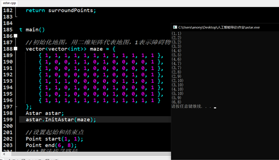
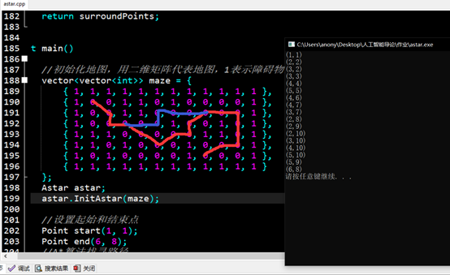

# Astar 研究报告

## Astar 基本原理：

### 估价函数：

`F = G + H`

G为代价函数，G = 从起点 A 移动到指定方格的移动代价，沿着到达该方格而生成的路径。横向和纵向的移动代价为 10 ，对角线的移动代价为 14 。之所以使用这些数据，是因为实际的对角移动距离是 $ \sqrt{2} $，或者是近似的1.414倍的横向或纵向移动代价。用 10 和 14 是为了简单起见。

H为启发函数，H = 从指定的方格移动到终点 B 的估算成本。这里采用欧几里得距离带计算，即两点之间的直线段长度。

### 过程：

1. 把起点加入 open表 。

2. 重复如下过程：

   a. 遍历 open表，查找 F 值最小的节点，把它作为当前要处理的节点。

   b. 把这个节点移到 close表 。

   c. 对当前方格的 8 个相邻方格的每一个方格？

   - 如果它是不可抵达的或者它在 close表中，忽略它。否则，做如下操作。
   - 如果它不在 open表中，把它加入 open表 ，并且把当前方格设置为它的父亲，记录该方格的 F ， G 和 H 值。
   - 如果它已经在 open表中，检查这条路径(即经由当前方格到达它那里) 是否更好，用 G 值作参考。更小的 G 值表示这是更好的路径。如果是这样，把它的父亲设置为当前方格，并重新计算它的 G 和 F 值。如果open表是按 F 值排序的话，改变后你可能需要重新排序。

   d. 停止，当你

   - 把终点加入到了 open表中，此时路径已经找到了，或者
   - 查找终点失败，并且 open表是空的，此时没有路径。
   
3. 保存路径。从终点开始，每个方格沿着父节点移动直至起点，这就是你的路径。

## Astar 核心代码实现：

```c++
#include <iostream>
#include <vector>
#include <list>
#include <math.h>
using namespace std;

const int kCost1 = 10; //直移一格消耗
const int kCost2 = 14; //斜移一格消耗
 
struct Point
{
	int x, y; //点坐标，照C++的数组来计算，x代表横排，y代表竖列
	int F, G, H; //F=G+H，H为启发函数，G为代价函数 
	Point *parent; //父节点坐标
	Point(int _x, int _y) :x(_x), y(_y), F(0), G(0), H(0), parent(NULL)  //变量初始化
	{
	}
};
 
class Astar
{
	public:
		void InitAstar(std::vector<std::vector<int>> &_maze);
		std::list<Point *> GetPath(Point &startPoint, Point &endPoint, bool isIgnoreCorner);
 
	private:
		Point *findPath(Point &startPoint, Point &endPoint, bool isIgnoreCorner);
		std::vector<Point *> getSurroundPoints(const Point *point, bool isIgnoreCorner) const;
		bool isCanreach(const Point *point, const Point *target, bool isIgnoreCorner) const; //判断某点是否可以用于下一步判断
		Point *isInList(const std::list<Point *> &list, const Point *point) const; //判断OPEN/CLOSE表中是否包含某点
		Point *getLeastFpoint(); //从OPEN表中返回F值最小的节点
		//计算FGH值
		int calcG(Point *temp_start, Point *point);
		int calcH(Point *point, Point *end);
		int calcF(Point *point);
	private:
		std::vector<std::vector<int>> maze;
		std::list<Point *> openList;  //OPEN表
		std::list<Point *> closeList; //CLOSE表
};


void Astar::InitAstar(std::vector<std::vector<int>> &_maze)
{
	maze = _maze;
}
 
int Astar::calcG(Point *temp_start, Point *point)
{
	int extraG = (abs(point->x - temp_start->x) + abs(point->y - temp_start->y)) == 1 ? kCost1 : kCost2;
	int parentG = point->parent == NULL ? 0 : point->parent->G; //如果是初始节点，则其父节点是空
	return parentG + extraG;
}
 
int Astar::calcH(Point *point, Point *end)
{
	//用欧几里得距离计算H，这个H的计算是关键，还有很多算法，如Manhattan算法等 
	return sqrt((double)(end->x - point->x)*(double)(end->x - point->x) + (double)(end->y - point->y)*(double)(end->y - point->y))*kCost1;
}
 
int Astar::calcF(Point *point)
{
	return point->G + point->H;
}
 
Point *Astar::getLeastFpoint()
{
	if (!openList.empty())
	{
		auto resPoint = openList.front();
		for (auto &point : openList)
		if (point->F<resPoint->F)
			resPoint = point;
		return resPoint;
	}
	return NULL;
}
 
Point *Astar::findPath(Point &startPoint, Point &endPoint, bool isIgnoreCorner)
{
	openList.push_back(new Point(startPoint.x, startPoint.y)); //置入起点,拷贝开辟一个节点，内外隔离
	while (!openList.empty())
	{
		auto curPoint = getLeastFpoint(); //找到F值最小的点
		openList.remove(curPoint); //从OPEN表中删除
		closeList.push_back(curPoint); //放到CLOSE表
		//1，找到当前周围八个格中可以通过的格子
		auto surroundPoints = getSurroundPoints(curPoint, isIgnoreCorner);
		for (auto &target : surroundPoints)
		{
			//2，对某一个格子，如果它不在OPEN表中，加入到OPEN表，设置当前格为其父节点，计算F G H
			if (!isInList(openList, target))
			{
				target->parent = curPoint;
 
				target->G = calcG(curPoint, target);
				target->H = calcH(target, &endPoint);
				target->F = calcF(target);
 
				openList.push_back(target);
			}
			//3，对某一个格子，它在OPEN表中，计算G值, 如果比原来的大, 就什么都不做, 否则设置它的父节点为当前点,并更新G和F
			else
			{
				int tempG = calcG(curPoint, target);
				if (tempG<target->G)
				{
					target->parent = curPoint;
 
					target->G = tempG;
					target->F = calcF(target);
				}
			}
			Point *resPoint = isInList(openList, &endPoint);
			if (resPoint)
				return resPoint; //返回表里的节点指针，不要用原来传入的endpoint指针，因为发生了深拷贝
		}
	}
 
	return NULL;
}
 
std::list<Point *> Astar::GetPath(Point &startPoint, Point &endPoint, bool isIgnoreCorner)
{
	Point *result = findPath(startPoint, endPoint, isIgnoreCorner);
	std::list<Point *> path;
	//返回路径，如果没找到路径，返回空链表
	while (result)
	{
		path.push_front(result);
		result = result->parent;
	}
 
	//清空临时开闭表，防止重复执行GetPath导致结果异常
	openList.clear();
	closeList.clear();
 
	return path;
}
 
Point *Astar::isInList(const std::list<Point *> &list, const Point *point) const
{
	//判断某个节点是否在表中，这里不能比较指针，因为每次加入表是新开辟的节点，只能比较坐标
	for (auto p : list)
	if (p->x == point->x&&p->y == point->y)
		return p;
	return NULL;
}
 
bool Astar::isCanreach(const Point *point, const Point *target, bool isIgnoreCorner) const
{
	if (target->x<0 || target->x>maze.size() - 1
		|| target->y<0 || target->y>maze[0].size() - 1
		|| maze[target->x][target->y] == 1
		|| target->x == point->x&&target->y == point->y
		|| isInList(closeList, target)) //如果点与当前节点重合、超出地图、是障碍物、或者在CLOSE表中，返回false
		return false;
	else
	{
		if (abs(point->x - target->x) + abs(point->y - target->y) == 1) //非斜角可以
			return true;
		else
		{
			//斜对角要判断是否绊住
			if (maze[point->x][target->y] == 0 && maze[target->x][point->y] == 0)
				return true;
			else
				return isIgnoreCorner;
		}
	}
}
 
std::vector<Point *> Astar::getSurroundPoints(const Point *point, bool isIgnoreCorner) const
{
	std::vector<Point *> surroundPoints;
 
	for (int x = point->x - 1; x <= point->x + 1; x++)
	for (int y = point->y - 1; y <= point->y + 1; y++)
	if (isCanreach(point, new Point(x, y), isIgnoreCorner))
		surroundPoints.push_back(new Point(x, y));
 
	return surroundPoints;
}
 
int main()
{
	//初始化地图，用二维矩阵代表地图，1表示障碍物，0表示可通
	vector<vector<int>> maze = {
		{ 1, 1, 1, 1, 1, 1, 1, 1, 1, 1, 1, 1 },
		{ 1, 0, 0, 1, 1, 0, 1, 0, 0, 0, 0, 1 },
		{ 1, 0, 0, 1, 1, 0, 0, 0, 0, 0, 0, 1 },
		{ 1, 0, 0, 0, 0, 0, 1, 0, 0, 1, 0, 1 },
		{ 1, 1, 1, 0, 0, 0, 0, 0, 1, 1, 0, 1 },
		{ 1, 1, 0, 1, 0, 0, 0, 1, 0, 0, 0, 1 },
		{ 1, 0, 1, 0, 0, 0, 0, 1, 0, 0, 0, 1 },
		{ 1, 1, 1, 1, 1, 1, 1, 1, 1, 1, 1, 1 }
	};
	Astar astar;
	astar.InitAstar(maze);
 
	//设置起始和结束点
	Point start(1, 1);
	Point end(6, 8);
	//A*算法找寻路径
	list<Point *> path = astar.GetPath(start, end, false);
	//打印
	for (auto &p : path)
		cout << '(' << p->x << ',' << p->y << ')' << endl;
 
	system("pause");
	return 0;
}
```

## 结果演示：



## 隐含的问题：



红线为按照此方法解出的路线，显然不是最短的，把中间那段红色换成蓝色这条明显更短。

## 原因分析：

这是由于启发函数H的选取导致的，因为H采用的是欧几里得距离，往右下角走距离较近，但考虑不到较远处出现障碍阻隔的情况。如果采用其他的启发函数的算法，或者调整F=H+G中H和G的比例，可能有所改善。