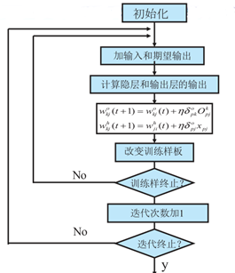

# BP神经网络研究报告

## BP神经网络基本原理

### BP神经网络：

人工神经网络无需事先确定输入输出之间映射关系的数学方程，仅通过自身的训练，学习某种规则，在给定输入值时得到最接近期望输出值的结果。作为一种智能信息处理系统，人工神经网络实现其功能的核心是算法。BP神经网络是一种按误差反向传播(简称误差反传)训练的多层前馈网络，其算法称为BP算法，它的基本思想是梯度下降法，利用梯度搜索技术，以期使网络的实际输出值和期望输出值的误差均方差为最小。

基本BP算法包括信号的前向传播和误差的反向传播两个过程。即计算误差输出时按从输入到输出的方向进行，而调整权值和阈值则从输出到输入的方向进行。正向传播时，输入信号通过隐含层作用于输出节点，经过非线性变换，产生输出信号，若实际输出与期望输出不相符，则转入误差的反向传播过程。误差反传是将输出误差通过隐含层向输入层逐层反传，并将误差分摊给各层所有单元，以从各层获得的误差信号作为调整各单元权值的依据。通过调整输入节点与隐层节点的联接强度和隐层节点与输出节点的联接强度以及阈值，使误差沿梯度方向下降，经过反复学习训练，确定与最小误差相对应的网络参数(权值和阈值)，训练即告停止。此时经过训练的神经网络即能对类似样本的输入信息，自行处理输出误差最小的经过非线形转换的信息。

### BP过程示意图：


### BP算法流程图：



## 核心代码实现

```c++
#include <stdio.h>
#include <time.h>
#include <math.h>
#include <stdlib.h>

#define Data  500   // 训练样本的数量
#define In 3            // 对于每个样本有多少个输入变量 
#define Out 1           // 对于每个样本有多少个输出变量
#define Neuron 20       // 神经元的数量 
#define TrainC 20000    // 表示训练的次数 
#define A  0.2          
#define B  0.4
#define a  0.2
#define b  0.3

// d_in[Data][In] 存储 Data 个样本，每个样本的 In 个输入
// d_out[Data][Out] 存储 Data 个样本，每个样本的 Out 个输出
double d_in[Data][In], d_out[Data][Out]; 

// w[Neuron][In]  表示某个输入对某个神经元的权重 
// v[Out][Neuron] 来表示某个神经元对某个输出的权重 
// 数组 o[Neuron] 记录的是神经元通过激活函数对外的输出 
// 与之对应的保存它们两个修正量的数组 dw[Neuron][In] 和 dv[Out][Neuron] 
double w[Neuron][In], v[Out][Neuron], o[Neuron];
double dw[Neuron][In], dv[Out][Neuron];

// Data个数据中  输入变量、输出变量的最大,最小值 
double Maxin[In],Minin[In],Maxout[Out],Minout[Out];

// OutputData[Out]  存储BP神经网络的输出 
double OutputData[Out];

// e用来监控误差 
double e;

//sigmoid激活函数 
double sigmoid(double sum){
    return 1/(1+exp(-1*sum));
} 

//生成实验数据并存入相应文件中
void writeTest(){      
    FILE *fp1,*fp2;
    double r1, r2, r3;
    int i;
 
    if((fp1=fopen("in.txt","w"))==NULL){
        printf("can not open the in file\n");
        exit(0);
    }
    if((fp2=fopen("out.txt","w"))==NULL){
        printf("can not open the out file\n");
        exit(0);
    }
    for(i=0;i<Data;i++){
        // 生成0~10的随机小数 
        r1=rand()%1000/100.0;
        r2=rand()%1000/100.0; 
        r3=rand()%1000/100.0;
        // 写入文件 
        fprintf(fp1,"%lf  %lf  %lf\n",r1,r2,r3);
        fprintf(fp2,"%lf \n",r1*r1+r2*r2+r3*r3);
    }
    fclose(fp1);
    fclose(fp2);
}
 
// 读入训练数据 
void readData(){
    FILE *fp1,*fp2;
    int i,j;
    if((fp1=fopen("in.txt","r"))==NULL){
        printf("can not open the in file\n");
        exit(0);
    }
    // 读入数据到 d_in[Data][In] 
    for(i=0;i<Data;i++)
        for(j=0; j<In; j++)
            fscanf(fp1,"%lf",&d_in[i][j]);
    fclose(fp1);
    if((fp2=fopen("out.txt","r"))==NULL){
        printf("can not open the out file\n");
        exit(0);
    }
    // 读入数据到 d_in[Data][Out] 
    for(i=0;i<Data;i++)
        for(j=0; j<Out; j++)
            fscanf(fp1,"%lf",&d_out[i][j]);
    fclose(fp2);
}
//初始化 
void initBPNework(){
    int i,j;
    for(i=0; i<In; i++){   //求Data个数据中 各输入变量的最大、最小值。
        Minin[i]=Maxin[i]=d_in[0][i];
        for(j=0; j<Data; j++)
        {
            Maxin[i]=Maxin[i]>d_in[j][i]?Maxin[i]:d_in[j][i];
            Minin[i]=Minin[i]<d_in[j][i]?Minin[i]:d_in[j][i];
        }
    }
    for(i=0; i<Out; i++){     //求Data个数据中 各输出变量的最大、最小值。
        Minout[i]=Maxout[i]=d_out[0][i];
        for(j=0; j<Data; j++)
        {
            Maxout[i]=Maxout[i]>d_out[j][i]?Maxout[i]:d_out[j][i];
            Minout[i]=Minout[i]<d_out[j][i]?Minout[i]:d_out[j][i];
        }
    }
    
    //输入数据归一化
    for (i = 0; i < In; i++)
        for(j = 0; j < Data; j++)
            d_in[j][i]=(d_in[j][i]-Minin[i]+1)/(Maxin[i]-Minin[i]+1);
            
    //输出数据归一化
    for (i = 0; i < Out; i++)    
        for(j = 0; j < Data; j++)
            d_out[j][i]=(d_out[j][i]-Minout[i]+1)/(Maxout[i]-Minout[i]+1);
    
    //初始化神经元
    for (i = 0; i < Neuron; ++i)    
        for (j = 0; j < In; ++j){   
            // rand()不需要参数，它会返回一个从0到最大随机数的任意整数 
            // rand()/RAND_MAX 为 (0, 1) 
            w[i][j]=rand()*2.0/RAND_MAX-1; // 权值初始化 
            dw[i][j]=0;
        }
        for (i = 0; i < Neuron; ++i)    
            for (j = 0; j < Out; ++j){
                v[j][i]=rand()*2.0/RAND_MAX-1; // 权值初始化 
                dv[j][i]=0;
            }
}

void computO(int var){   //第var组数据在隐藏层和输出层的输出结果o[]和outputdata[]。
    int i,j;
    double sum,y;
    // 神经元输出 
    for (i = 0; i < Neuron; ++i){
        sum=0;
        for (j = 0; j < In; ++j)
            sum+=w[i][j]*d_in[var][j];
        //Sigmoid 函数---激活函数 
        o[i]=sigmoid(sum);
    }
    
    //  隐藏层到输出层输出 
    for (i = 0; i < Out; ++i){
        sum=0;
        for (j = 0; j < Neuron; ++j)
            sum+=v[i][j]*o[j];
        OutputData[i]=sum;
    }   
}
 
//从后向前更新权值
void backUpdate(int var){
    int i,j;
    double t;
    for (i = 0; i < Neuron; ++i){
        t=0;
        for (j = 0; j < Out; ++j){
            t+=(OutputData[j]-d_out[var][j])*v[j][i];
            
            dv[j][i]=A*dv[j][i]+B*(OutputData[j]-d_out[var][j])*o[i];
            v[j][i]-=dv[j][i];
        }

        for (j = 0; j < In; ++j){
            dw[i][j]=a*dw[i][j]+b*t*o[i]*(1-o[i])*d_in[var][j];
            w[i][j]-=dw[i][j];
        }
    }
}

//用训练完的神经网络给它数据计算结果 
double result(double var[]){
    int i,j;
    double sum,y;
    double tmp[In];
    //归一化 
    for (i = 0; i < In; ++i){
        tmp[i]=(var[i]-Minin[i]+1)/(Maxin[i]-Minin[0]+1);
    }
    //到隐藏层 
    for (i = 0; i < Neuron; ++i){
        sum=0;
        for (j = 0; j < In; ++j){
            sum+=w[i][j]*tmp[j];
        }
        o[i]=sigmoid(sum);
    }
    //到输出 
    for (i = 0; i < Out; ++i){
        sum=0;
        for (j = 0; j < Neuron; ++j){
            sum+=v[i][j]*o[j]; 
        }
    }
    //反归一化
    return sum*(Maxout[0]-Minout[0]+1)+Minout[0]-1;
}
 
void writeNeuron(){
    FILE *fp1;
    int i,j;
    if((fp1=fopen("neuron.txt","w"))==NULL)
    {
        printf("can not open the neuron file\n");
        exit(0);
    }
    for (i = 0; i < Neuron; ++i){
        for (j = 0; j < In; ++j){
            fprintf(fp1,"%lf ",w[i][j]);
        }
    }
    fprintf(fp1,"\n\n\n\n");
    for (i = 0; i < Neuron; ++i){
        for (j = 0; j < Out; ++j){
            fprintf(fp1,"%lf ",v[j][i]);
        }
    }
    fclose(fp1);
}
 

/*三个输入a、b、c（10以内的数），一个输出 d，d=a^2+b^2+c^2。
教BP神经网络 */
void  trainNetwork(){
    int i,c=0,j;
    do{
        e=0;
        for (i = 0; i < Data; ++i){
            computO(i);//计算隐藏层和输出层所有神经元的输出。
            
            for (j = 0; j < Out; ++j)
                e+=fabs((OutputData[j]-d_out[i][j])/d_out[i][j]);//fabs（）求绝对值 
                
            backUpdate(i);//反向修改权值
        }
        printf("%d  %lf\n",c,e/Data);
        c++;
    }while(c<TrainC);
}
 

int main(int argc, char* argv[]){
    double result_true,result_n;
    double x[In];
    clock_t startTime, endTime;
    srand(time(NULL)); 
    writeTest();//随机生成Data个数据，输入变量存在in.txt中，输出变量存在out.txt中 
    readData();//准备从文件读入训练数据训练数据。
    initBPNework();//输入、输出数据归一化，以及网络权值初始化。
    startTime=clock();
    trainNetwork();//训练网络。
    endTime=clock();
    printf("训练结束，用时%lfs\n",(double)(endTime-startTime)/CLOCKS_PER_SEC); 
    printf("测试数据\t\t神经网络计算结果\t正确结果\t相对误差\n"); 
    for(int i=0; i<10; ++i){
        for(int j=0; j<In; ++j){
            x[j]=rand()%1000/100.0;
        }
        result_true=x[0]*x[0]+x[1]*x[1]+x[2]*x[2];
        result_n=result(x);
        printf("(%lf,%lf,%lf)\t%lf\t%lf\t%lf\n", x[0], x[1], x[2], result_n, result_true, fabs(result_true-result_n)/result_true);
    }
    writeNeuron();//保存权值。
    return 0;
 
}
```


## 结果演示

样本数量500，隐藏层神经元数20，训练次数20000（对照组）：

 


样本数量100，隐藏层神经元数20，训练次数20000：


样本数量500，隐藏层神经元数20，训练次数10000：


样本数量500，隐藏层神经元数5，训练次数20000：


## 讨论分析

此程序是教会BP神经网络计算a2+b2+c2的程序，从程序运行结果来看，发现训练集的样本数量、训练次数、隐藏层神经元的数量等参数会对训练结果以及测试时的准确率产生影响。

对照组（样本数量500，隐藏层神经元数20，训练次数20000）的结果，测试数据的神经网络计算结果与理论正确值之间的相对百分比误差比较理想，基本上相对误差在5%以内。

若样本数量减少，虽然训练时间缩短，但训练结果的误差会变大，测试时的准确率也会降低。

若隐藏层神经元数量太少，误差非常的大，准确率非常低。

若训练次数减少，可以缩短训练时间，但误差会变大。

总之，训练用时和准确率两者不可兼得，要适当地调整各参数，才能得到比较均衡的结果。

另外，在同一组实验中，有一些测试数据的结果相对误差较其他数据大很多，这很有可能由于这些随机到的数字比较小，受double类的数的精度限制，在归一化和反归一化的过程中，精度丢失导致的，而不是神经网络本身的问题。

