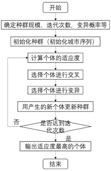

# 遗传算法研究报告

## 遗传算法基本原理：

### 遗传算法：

遗传算法（GeneticAlgorithm）是模拟达尔文生物进化论的自然选择和遗传学机理的生物进化过程的计算模型，通过模拟自然进化过程搜索最优解。遗传算法是从首先是初始化一个种群，然后根据适应性函数确定个体的适应度，由适应度来选择个体进行交叉，以某种概率让个体进行变异，从而不断选出适应度高的个体，进而更新种群。

### 流程图：



### 程序步骤：

1. 初始化城市序列的坐标，从文件读取我国34个省会的坐标，种群规模为100，变异率为0.01；

2. 用欧式距离计算城市序列中每个个体的适应度；

3. 根据适应度来选择个体作为交叉操作的父体，选择完之后用顺序交叉来进行交叉操作；

4. 以一定的变异概率来确定是否对个体进行变异，如果需要进行变异，则随机选择个体的两个城市进行交换；

5. 选择适应度最好的20个精英个体直接保留到下一代，下一代的其他个体按照个体的适应度进行选择。

6. 判断是否达到迭代次数，如果没有转到第2步，达到的话转到第7步。

7. 输出适应度最好的个体。

## 核心代码实现（Python）：

```python
import numpy as np
import random
import copy
import matplotlib.pyplot as plt
 
class City:
    def __init__(self, x, y):
        self.x = x
        self.y = y
 
    def __repr__(self):
        return "(" + str(self.x) + "," + str(self.y) + ")"
 
def distance(ca, cb):
    dx = abs(ca.x - cb.x)
    dy = abs(ca.y - cb.y)
    distance = np.sqrt((dx ** 2) + (dy ** 2))
    return distance
 
def init_pop(city_list, popSize):
    pop = []
    for i in range(popSize):
        new_city_list = random.sample(city_list, len(city_list))
        pop.append(new_city_list)
 
    return pop
 
def fitness(pop):
    dis_citys = distance_citys(pop)
    return 1.0/dis_citys
 
def distance_citys(pop):
    temp_dis = 0
    for i in range(len(pop)-1):
        temp_dis += distance(pop[i], pop[i+1])
    temp_dis += distance(pop[len(pop)-1], pop[0])
 
    return temp_dis
 
def rank(poplulation):
    rankPop_dic = {}
    for i in range(len(poplulation)):
        fit = fitness(poplulation[i])
        rankPop_dic[i] = fit
 
    return sorted(rankPop_dic.items(), key=lambda x:x[1], reverse=True)
 
 
def select(pop, pop_rank, eliteSize):
    select_pop = []
    for i in range(eliteSize):
        select_pop.append(pop[pop_rank[i][0]])
 
    cumsum = 0
    cumsum_list = []
    temp_pop = copy.deepcopy(pop_rank)
    for i in range(len(temp_pop)):
        cumsum += temp_pop[i][1]
        cumsum_list.append(cumsum)
    for i in range(len(temp_pop)):
        cumsum_list[i] /= cumsum
 
    for i in range(len(temp_pop)-eliteSize):
        rate = random.random()
        for j in range(len(temp_pop)):
            if cumsum_list[j] > rate:
                select_pop.append(pop[pop_rank[i][0]])
                break
 
    return select_pop
 
def breed(pop, eliteSize):
    breed_pop = []
    for i in range(eliteSize):
        breed_pop.append(pop[i])
 
    i = 0
    while i < (len(pop)-eliteSize):
        a = random.randint(0, len(pop)-1)
        b = random.randint(0, len(pop)-1)
        if a != b:
            fa, fb = pop[a], pop[b]
            genea, geneb = random.randint(0, len(pop[a])-1), random.randint(0, len(pop[b])-1)
            startgene = min(genea, geneb)
            endgene = max(genea, geneb)
            child1 = []
            for j in range(startgene, endgene):
                child1.append(fa[j])
            # child1 = copy.deepcopy(fa[:-1])
            child2 = []
            for j in fb:
                if j not in child1:
                    child2.append(j)
            # child2 = [j for j in fb if j not in child1]
            breed_pop.append(child1+child2)
            i = i+1
 
    return breed_pop
 
def mutate(pop, mutationRate):
    mutation_pop = []
    for i in range(len(pop)):
        for j in range(len(pop[i])):
            rate = random.random()
            if rate < mutationRate:
                a = random.randint(0, len(pop[i])-1)
                pop[i][a], pop[i][j] = pop[i][j], pop[i][a]
        mutation_pop.append(pop[i])
 
    return mutation_pop
 
 
def next_pop(population, eliteSize, mutationRate):
    pop_rank = rank(population) #按照适应度排序
    select_pop = select(population, pop_rank, eliteSize) #精英选择策略，加上轮盘赌选择
    breed_pop = breed(select_pop, eliteSize) #繁殖
    next_generation = mutate(breed_pop, mutationRate) #变异
 
    return next_generation
 
#画出路线图的动态变化
def GA_plot_dynamic(city_list, popSize, eliteSize, mutationRate, generations):
    plt.figure('Map')
    plt.ion()
    population = init_pop(city_list, popSize)
 
    print("initial distance:{}".format(1.0/(rank(population)[0][1])))
    for i in range(generations):
        plt.cla()
        population = next_pop(population, eliteSize, mutationRate)
        idx_rank_pop = rank(population)[0][0]
        best_route = population[idx_rank_pop]
        city_x = []
        city_y = []
        for j in range(len(best_route)):
            city = best_route[j]
            city_x.append(city.x)
            city_y.append(city.y)
        city_x.append(best_route[0].x)
        city_y.append(best_route[0].y)
        plt.scatter(city_x, city_y, c='r', marker='*', s=200, alpha=0.5)
        plt.plot(city_x, city_y, "b", ms=20)
        plt.pause(0.1)
 
    plt.ioff()
    plt.show()
 
    print("final distance:{}".format(1.0 / (rank(population)[0][1])))
    bestRouteIndex = rank(population)[0][0]
    bestRoute = population[bestRouteIndex]
    return bestRoute
 
def GA(city_list, popSize, eliteSize, mutationRate, generations):
    population = init_pop(city_list, popSize) #初始化种群
    process = []
 
    print("initial distance:{}".format(1.0/(rank(population)[0][1])))
    for i in range(generations):
        population = next_pop(population, eliteSize, mutationRate) #产生下一代种群
        process.append(1.0 / (rank(population)[0][1]))
 
    plt.figure(1)
    print("final distance:{}".format(1.0 / (rank(population)[0][1])))
    plt.plot(process)
    plt.ylabel('Distance')
    plt.xlabel('Generation')
    plt.savefig(str(generations)+ '_' + str(1.0 / (rank(population)[0][1])) + '_' + str(mutationRate) +'_process.png')
 
    plt.figure(2)
    idx_rank_pop = rank(population)[0][0]
    best_route = population[idx_rank_pop]
    city_x = []
    city_y = []
    for j in range(len(best_route)):
        city = best_route[j]
        city_x.append(city.x)
        city_y.append(city.y)
    city_x.append(best_route[0].x)
    city_y.append(best_route[0].y)
    plt.scatter(city_x, city_y, c='r', marker='*', s=200, alpha=0.5)
    plt.plot(city_x, city_y, "b", ms=20)
 
    plt.savefig(str(generations)+'_' + str(mutationRate) + '_route.png')
    plt.show()
 
num_city = 25
city_list = []
 
# for i in range(num_city):
#     x = random.randint(1, 200)
#     y = random.randint(1, 200)
#     city_list.append(City(x, y))

with open('city.txt', 'r', encoding='UTF-8') as f:
    lines = f.readlines()
for line in lines:
    line = line.replace('\n', '')
    # line = line.replace('\t', '')
    city = line.split('\t')
    city_list.append( City( float(city[1]), float(city[2]) ) )
 
# mutationRates = [0.001, 0.002, 0.005, 0.008, 0.01, 0.02]
# for mut in mutationRates:
GA(city_list, 100, 20, 0.01, 2000)
```

## 结果演示：

突变率0.01，迭代200次的结果：


突变率0.01，迭代500次的结果：


突变率0.01，迭代2000次的结果：


突变率0.01，迭代5000次的结果：


突变率0.1，迭代2000次的结果：


突变率0.001，迭代2000次的结果：


## 讨论分析：

从Distance-Generation曲线可见，迭代次数前几百代的优化效果明显，曲线成快速下降趋势，到了几千代以上时，曲线逐渐趋于平缓。迭代次数太少无法得到最优解，迭代次数太多要花费很多的时间。

从Distance-Generation曲线来看，有很多“上升”的小段曲线，这是以一定的概率突变产生的。突变率是比较关键的一个参数，突变率太大的话，曲线很难趋于平稳，到了几千代还是有很大波动；若突变率太小的话，很难跳出局部最小的情况。

所以选择合适的突变率以及合适的迭代次数，是又快又好的解决问题的关键。